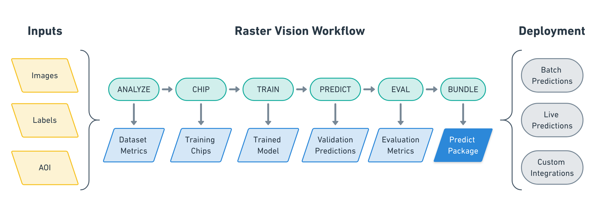

&nbsp;

[](https://pypi.org/project/rastervision/)
[](https://quay.io/repository/azavea/raster-vision)
[](https://gitter.im/azavea/raster-vision?utm_source=badge&utm_medium=badge&utm_campaign=pr-badge&utm_content=badge)
[](https://opensource.org/licenses/Apache-2.0)
[](http://travis-ci.org/azavea/raster-vision)
[](https://codecov.io/gh/azavea/raster-vision)

Raster Vision is an open source Python framework for building computer vision models on satellite, aerial, and other large imagery sets (including oblique drone imagery).
* It allows users (who don't need to be experts in deep learning!) to quickly and repeatably configure experiments that execute a machine learning workflow including: analyzing training data, creating training chips, training models, creating predictions, evaluating models, and bundling the model files and configuration for easy deployment.

* There is built-in support for chip classification, object detection, and semantic segmentation using Tensorflow.

* Experiments can be executed on CPUs and GPUs with built-in support for running in the cloud using [AWS Batch](https://github.com/azavea/raster-vision-aws).
* The framework is extensible to new data sources, tasks (eg. object detection), backends (eg. TF Object Detection API), and cloud providers.
* There is a [QGIS plugin](https://github.com/azavea/raster-vision-qgis) for viewing the results of experiments on a map.

See the documentation for more details: https://docs.rastervision.io

### Example

The best way to get a feel for what Raster Vision enables is to look at an example of how to configure and run an experiment. Experiments are configured using a fluent builder pattern that makes configuration easy to read, reuse and maintain.

```python
# tiny_spacenet.py

import rastervision as rv

class TinySpacenetExperimentSet(rv.ExperimentSet):
    def exp_main(self):
        base_uri = ('https://s3.amazonaws.com/azavea-research-public-data/'
                    'raster-vision/examples/spacenet')
        train_image_uri = '{}/RGB-PanSharpen_AOI_2_Vegas_img205.tif'.format(base_uri)
        train_label_uri = '{}/buildings_AOI_2_Vegas_img205.geojson'.format(base_uri)
        val_image_uri = '{}/RGB-PanSharpen_AOI_2_Vegas_img25.tif'.format(base_uri)
        val_label_uri = '{}/buildings_AOI_2_Vegas_img25.geojson'.format(base_uri)
        channel_order = [0, 1, 2]
        background_class_id = 2

        # ------------- TASK -------------

        task = rv.TaskConfig.builder(rv.SEMANTIC_SEGMENTATION) \
                            .with_chip_size(512) \
                            .with_chip_options(chips_per_scene=50) \
                            .with_classes({
                                'building': (1, 'red')
                            }) \
                            .build()

        # ------------- BACKEND -------------

        backend = rv.BackendConfig.builder(rv.TF_DEEPLAB) \
                                  .with_task(task) \
                                  .with_debug(True) \
                                  .with_batch_size(1) \
                                  .with_num_steps(1) \
                                  .with_model_defaults(rv.MOBILENET_V2)  \
                                  .build()

        # ------------- TRAINING -------------

        train_raster_source = rv.RasterSourceConfig.builder(rv.GEOTIFF_SOURCE) \
                                             .with_uri(train_image_uri) \
                                             .with_channel_order(channel_order) \
                                             .with_stats_transformer() \
                                             .build()

        train_label_raster_source = rv.RasterSourceConfig.builder(rv.RASTERIZED_SOURCE) \
                                                         .with_vector_source(train_label_uri) \
                                                         .with_rasterizer_options(background_class_id) \
                                                         .build()
        train_label_source = rv.LabelSourceConfig.builder(rv.SEMANTIC_SEGMENTATION) \
                                                 .with_raster_source(train_label_raster_source) \
                                                 .build()

        train_scene =  rv.SceneConfig.builder() \
                                     .with_task(task) \
                                     .with_id('train_scene') \
                                     .with_raster_source(train_raster_source) \
                                     .with_label_source(train_label_source) \
                                     .build()

        # ------------- VALIDATION -------------

        val_raster_source = rv.RasterSourceConfig.builder(rv.GEOTIFF_SOURCE) \
                                                 .with_uri(val_image_uri) \
                                                 .with_channel_order(channel_order) \
                                                 .with_stats_transformer() \
                                                 .build()

        val_label_raster_source = rv.RasterSourceConfig.builder(rv.RASTERIZED_SOURCE) \
                                                       .with_vector_source(val_label_uri) \
                                                       .with_rasterizer_options(background_class_id) \
                                                       .build()
        val_label_source = rv.LabelSourceConfig.builder(rv.SEMANTIC_SEGMENTATION) \
                                               .with_raster_source(val_label_raster_source) \
                                               .build()

        val_scene = rv.SceneConfig.builder() \
                                  .with_task(task) \
                                  .with_id('val_scene') \
                                  .with_raster_source(val_raster_source) \
                                  .with_label_source(val_label_source) \
                                  .build()

        # ------------- DATASET -------------

        dataset = rv.DatasetConfig.builder() \
                                  .with_train_scene(train_scene) \
                                  .with_validation_scene(val_scene) \
                                  .build()

        # ------------- EXPERIMENT -------------

        experiment = rv.ExperimentConfig.builder() \
                                        .with_id('tiny-spacenet-experiment') \
                                        .with_root_uri('/opt/data/rv') \
                                        .with_task(task) \
                                        .with_backend(backend) \
                                        .with_dataset(dataset) \
                                        .with_stats_analyzer() \
                                        .build()

        return experiment


if __name__ == '__main__':
    rv.main()
```

Raster Vision uses a unittest-like method for executing experiments. For instance, if the above was defined in `tiny_spacenet.py`, with the proper setup you could run the experiment on AWS Batch by running:

```bash
> rastervision run aws_batch -p tiny_spacenet.py
```

See the [Quickstart](https://docs.rastervision.io/en/0.8/quickstart.html) for a more complete description of running this example.

### Resources

* [Raster Vision Documentation](https://docs.rastervision.io)
* [raster-vision-examples](https://github.com/azavea/raster-vision-examples): A repository of examples of running RV on open datasets
* [raster-vision-aws](https://github.com/azavea/raster-vision-aws): Deployment code for setting up AWS Batch with GPUs
* [raster-vision-qgis](https://github.com/azavea/raster-vision-qgis): A QGIS plugin for visualizing the results of experiments on a map

### Contact and Support

You can find more information and talk to developers (let us know what you're working on!) at:
* [Gitter](https://gitter.im/azavea/raster-vision)
* [Mailing List](https://groups.google.com/forum/#!forum/raster-vision)

### Docker images

Raster Vision is publishing docker images to [quay.io](https://quay.io/repository/azavea/raster-vision).
The tag for the `raster-vision` image determines what type of image it is:
- The `cpu-*` tags are for running the CPU containers.
- The `gpu-*` tags are for running the GPU containers.

We publish a new tag per merge into `master`, which is tagged with the first 7 characters of the commit hash.
To use the latest version, pull the `latest` suffix, e.g. `raster-vision:gpu-latest`.
Git tags are also published, with the github tag name as the docker tag suffix.

### Contributing

We are happy to take contributions! It is best to get in touch with the maintainers
about larger features or design changes *before* starting the work,
as it will make the process of accepting changes smoother.

Everyone who contributes code to Raster Vision will be asked to sign the
Azavea CLA, which is based off of the Apache CLA.

1. Download a copy of the [Raster Vision Individual Contributor License
   Agreement](docs/_static/cla/2018_04_17-Raster-Vision-Open-Source-Contributor-Agreement-Individual.pdf)
   or the [Raster Vision Corporate Contributor License
   Agreement](docs/_static/cla/2018_04_18-Raster-Vision-Open-Source-Contributor-Agreement-Corporate.pdf)

2. Print out the CLAs and sign them, or use PDF software that allows placement of a signature image.

3. Send the CLAs to Azavea by one of:
  - Scanning and emailing the document to cla@azavea.com
  - Faxing a copy to +1-215-925-2600.
  - Mailing a hardcopy to:
    Azavea, 990 Spring Garden Street, 5th Floor, Philadelphia, PA 19107 USA
