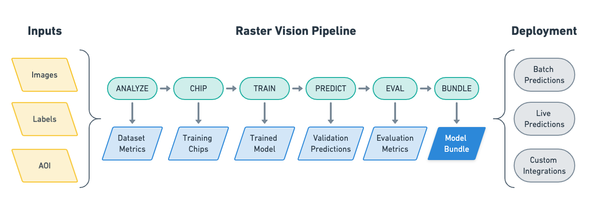

&nbsp;

[](https://pypi.org/project/rastervision/)
[](https://quay.io/repository/azavea/raster-vision)
[](https://gitter.im/azavea/raster-vision?utm_source=badge&utm_medium=badge&utm_campaign=pr-badge&utm_content=badge)
[](https://opensource.org/licenses/Apache-2.0)
[](https://github.com/azavea/raster-vision/actions/workflows/release.yml)
[](https://codecov.io/gh/azavea/raster-vision)
[](https://docs.rastervision.io/en/latest/?badge=latest)

Raster Vision is an open source Python framework for building computer vision models on satellite, aerial, and other large imagery sets (including oblique drone imagery).
* It allows users (who don't need to be experts in deep learning!) to quickly and repeatably configure experiments that execute a machine learning pipeline including: analyzing training data, creating training chips, training models, creating predictions, evaluating models, and bundling the model files and configuration for easy deployment.

* There is built-in support for chip classification, object detection, and semantic segmentation with backends using PyTorch.

* Experiments can be executed on CPUs and GPUs with built-in support for running in the cloud using [AWS Batch](https://github.com/azavea/raster-vision-aws).
* The framework is extensible to new data sources, tasks (eg. instance segmentation), backends (eg. Detectron2), and cloud providers.

See the [documentation](https://docs.rastervision.io) for more details.

### Setup

There are several ways to setup Raster Vision:
* To build Docker images from scratch, after cloning this repo, run `docker/build`, and run the container using `docker/run`.
* Docker images are published to [quay.io](https://quay.io/repository/azavea/raster-vision). The tag for the `raster-vision` image determines what type of image it is:
    - The `pytorch-*` tags are for running the PyTorch containers.
    - We publish a new tag per merge into `master`, which is tagged with the first 7 characters of the commit hash. To use the latest version, pull the `latest` suffix, e.g. `raster-vision:pytorch-latest`. Git tags are also published, with the Github tag name as the Docker tag suffix.
* Raster Vision can be installed directly using `pip install rastervision`. However, some of its dependencies will have to be installed manually.

For more detailed instructions, see the [Setup docs](https://docs.rastervision.io/en/0.13/setup.html).

### Example

The best way to get a feel for what Raster Vision enables is to look at an example of how to configure and run an experiment. Experiments are configured using a fluent builder pattern that makes configuration easy to read, reuse and maintain.

```python
# tiny_spacenet.py

from rastervision.core.rv_pipeline import *
from rastervision.core.backend import *
from rastervision.core.data import *
from rastervision.pytorch_backend import *
from rastervision.pytorch_learner import *


def get_config(runner) -> SemanticSegmentationConfig:
    root_uri = '/opt/data/output/'
    base_uri = ('https://s3.amazonaws.com/azavea-research-public-data/'
                'raster-vision/examples/spacenet')

    train_image_uri = f'{base_uri}/RGB-PanSharpen_AOI_2_Vegas_img205.tif'
    train_label_uri = f'{base_uri}/buildings_AOI_2_Vegas_img205.geojson'
    val_image_uri = f'{base_uri}/RGB-PanSharpen_AOI_2_Vegas_img25.tif'
    val_label_uri = f'{base_uri}/buildings_AOI_2_Vegas_img25.geojson'

    channel_order = [0, 1, 2]
    class_config = ClassConfig(
        names=['building', 'background'], colors=['red', 'black'])

    def make_scene(scene_id: str, image_uri: str,
                   label_uri: str) -> SceneConfig:
        """
        - The GeoJSON does not have a class_id property for each geom,
          so it is inferred as 0 (ie. building) because the default_class_id
          is set to 0.
        - The labels are in the form of GeoJSON which needs to be rasterized
          to use as label for semantic segmentation, so we use a RasterizedSource.
        - The rasterizer set the background (as opposed to foreground) pixels
          to 1 because background_class_id is set to 1.
        """
        raster_source = RasterioSourceConfig(
            uris=[image_uri], channel_order=channel_order)
        vector_source = GeoJSONVectorSourceConfig(
            uri=label_uri,
            ignore_crs_field=True,
            transformers=[ClassInferenceTransformerConfig(default_class_id=0)])
        label_source = SemanticSegmentationLabelSourceConfig(
            raster_source=RasterizedSourceConfig(
                vector_source=vector_source,
                rasterizer_config=RasterizerConfig(background_class_id=1)))
        return SceneConfig(
            id=scene_id,
            raster_source=raster_source,
            label_source=label_source)

    scene_dataset = DatasetConfig(
        class_config=class_config,
        train_scenes=[
            make_scene('scene_205', train_image_uri, train_label_uri)
        ],
        validation_scenes=[
            make_scene('scene_25', val_image_uri, val_label_uri)
        ])

    # Use the PyTorch backend for the SemanticSegmentation pipeline.
    chip_sz = 300

    backend = PyTorchSemanticSegmentationConfig(
        data=SemanticSegmentationGeoDataConfig(
            scene_dataset=scene_dataset,
            window_opts=GeoDataWindowConfig(
                method=GeoDataWindowMethod.random,
                size=chip_sz,
                size_lims=(chip_sz, chip_sz + 1),
                max_windows=10)),
        model=SemanticSegmentationModelConfig(backbone=Backbone.resnet50),
        solver=SolverConfig(lr=1e-4, num_epochs=1, batch_sz=2))

    return SemanticSegmentationConfig(
        root_uri=root_uri,
        dataset=scene_dataset,
        backend=backend,
        train_chip_sz=chip_sz,
        predict_chip_sz=chip_sz)

```

Raster Vision uses a unittest-like method for executing experiments. For instance, if the above was defined in `tiny_spacenet.py`, with the proper setup you could run the experiment using:

```bash
> rastervision run local tiny_spacenet.py
```

See the [Quickstart](https://docs.rastervision.io/en/0.13/quickstart.html) for a more complete description of running this example.

### Resources

* [Raster Vision Documentation](https://docs.rastervision.io)

### Contact and Support

You can find more information and talk to developers (let us know what you're working on!) at:
* [Gitter](https://gitter.im/azavea/raster-vision)
* [Mailing List](https://groups.google.com/forum/#!forum/raster-vision)

### Contributing

We are happy to take contributions! It is best to get in touch with the maintainers
about larger features or design changes *before* starting the work,
as it will make the process of accepting changes smoother.

Everyone who contributes code to Raster Vision will be asked to sign the
Azavea CLA, which is based off of the Apache CLA.

1. Download a copy of the [Raster Vision Individual Contributor License
   Agreement](docs/_static/cla/2018_04_17-Raster-Vision-Open-Source-Contributor-Agreement-Individual.pdf)
   or the [Raster Vision Corporate Contributor License
   Agreement](docs/_static/cla/2018_04_18-Raster-Vision-Open-Source-Contributor-Agreement-Corporate.pdf)

2. Print out the CLAs and sign them, or use PDF software that allows placement of a signature image.

3. Send the CLAs to Azavea by one of:
  - Scanning and emailing the document to cla@azavea.com
  - Faxing a copy to +1-215-925-2600.
  - Mailing a hardcopy to:
    Azavea, 990 Spring Garden Street, 5th Floor, Philadelphia, PA 19107 USA
